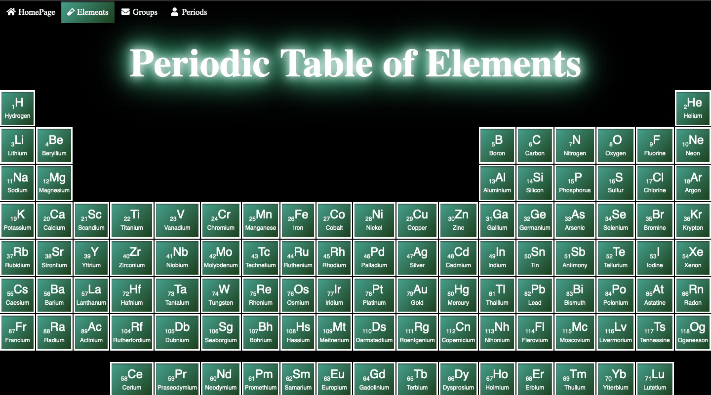
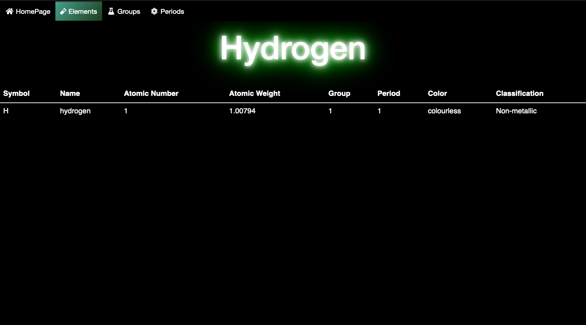
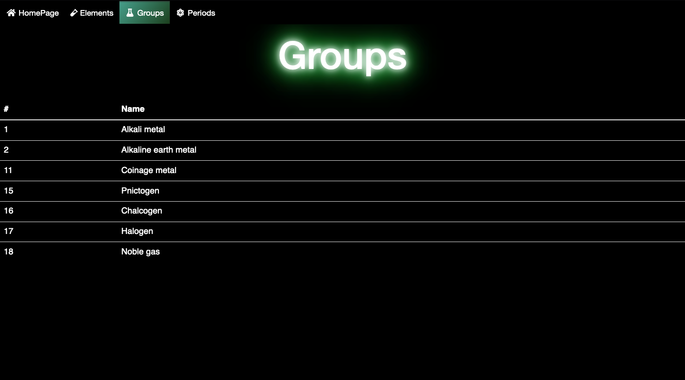
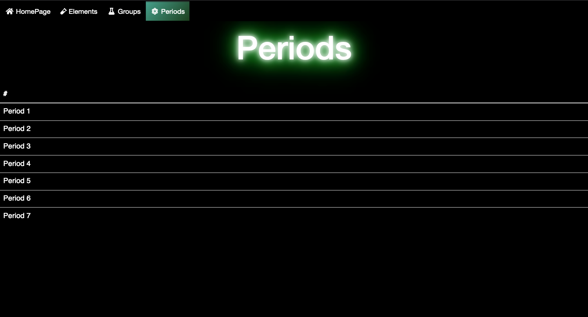

# Periodic Table Of The Elements


## How to run

 :GraphDB

```sh
Import on GraphDB the Periodic_Table.rdf file
```

 :Nodejs

```sh
$ npm start
```

## HomePage

 
## Elements



## Element


## Groups


## Group


## Periods


## Period

